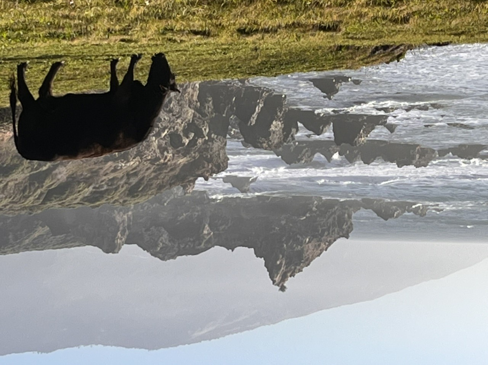

##### bluh bluh

The Movies Project is something like **Netflix**, the only difference is that **it's not real**! It doesn't exist! I just created it to demonstrate how the **showcase** page looks like and how you can write whatever you want with full markdown support.

##### Bluh Bluh



