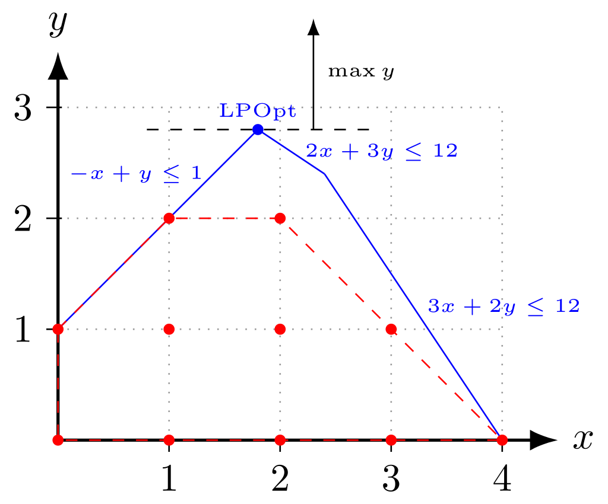

I have always been curious about optimization problems and puzzles that could be mathematically modelled and solved via numerical methods/algorithms. In this project I am trying to solve a Sudoku problem with Integer Programming. Also, below is a quick introduction to Linear Programming (LP), Integer Programming (IP) and some of useful optimization frameworks and solvers. <br/><br/>
##### **Linear Programming ?** <br/>
In Optimization problems we normally formulate an objective function that we want to either maximize or minimize. In addition, we have a set of constraints that are rules/limits for the optimization task. In any optimization process we should fully understand the real world problem to be able to convert it to mathematical terms. If we can model the optimization problem mathematically in a way that all the variables are continuous and all the functions are linear we can use Linear Programming (LP).


##### **Integer Programming ?** <br/>
Similarly, **Integer programming** is the class of problems that can be expressed as the optimization of a linear function subject to a set of linear constraints over integer variables. In Linear Programming the output can be decimal or a fraction, however we use Integer Programming when all variables are integers. Theoretically Integer Programming is much more difficult that Linear Programming. Integer Programming problem is in fact NP-hard. More importantly, probably, is the fact that the Integer Programs that can be solved to provable optimality in reasonable time are much smaller in size than their Linear Programming counterparts. A typical example of integer programs is the knapsack problem.
There are other types of mathematical Programming, such as **MIP (stands for Mixed Integer Programming)**, in which some of the variables can be relaxed to fractions, which doesn't make it necessarily easier but makes it more interesting in my opinion. Also there is **BIP (Binary Integer Programming)** , which all of the variables are binary either 0 or 1.
Mathematically speaking, in LP the domain of variable, let's say x, is x ∈ R. While in IP x ∈ Z. For BIP x ∈ {0,1} and for MIP x ∈ {Z,R}.
To wrap up the introduction to IP and its difference with LP let's look into this image(from Wikipedia). Let's say in our problem we have five constraints which is shown with blue line in figure below. For LP the feasible solution is the entire blue region, however for IP (when we have additional conditions of integer constraints) the  feasible solution is the set of red dots.

As we can see, a good thing about IP is that we have a finite solution space, eg red dots in example above. Since our choice variables can only take on the integer values, we only need to consider those individual values. We can actually iterate over all possible combinations in our solution space. <br/><br/>

##### **Which FrameWork to Use**
There are multiple ways to approach LP and IP code-wise. Here is a list framework that can be used to solve IP and LP problems; **Pyomo**, **Ortools**, **PuLP**, **SCIP** and **SciPy**. For Solving Sudoku problem I have used **Ortool** because it is easy to start with and implement.<br><br>
**OrTools**: Developed by google and is recommended for LP and IP. It can be installed with "pip install -U ortools". below is a simple example solved with **Ortools** framework and **GLOP** as solver.<br>
```python
from ortools.linear_solver import pywraplp

#Setting up the solver
solver=pywraplp.Solver.CreateSolver('GLOP')
x=solver.NumVar(0,10,'x')
y=solver.NumVar(0,10,'y')

#Constraints
solver.Add(-x+y<=1)
solver.Add(2*x+3*y<=12)
solver.Add(3*x+2*y<=12)

#Objective Function
solver.Maximize(x+y)

#Result and Output
results=solver.Solve()
if results==pywraplp.Solver.OPTIMAL: print('Optimal Solution Found')
print('x:',x.solution_value())
print('y:',y.solution_value())
```
<br>
**SCIP**: It can solve LP, IP and non-linear problems. Also it can be used for mixed integer programming (MIP) and mixed integer nonlinear programming (MINLP). It can be downloaded from "https://www.scipopt.org/". Below is a nonlinear example. <br>
```python
from pyscipopt import Model
model=Model('non-linear')

x=model.addVar('x')
y=model.addVar('y')

#Objective Function
model.setObjective(x+y, sense='maximize')

#Non-linear constraints
model.addCons(-x+y<=1)
model.addCons(2*x+3*x*y<=12)
model.addCons(3*x+2*y<=12)

model.optimize()
result_=model.getBestSol()

print('x:',result_[x])
print('y:',result_[y])
```
<br>
**Gurobi**: Gurobi is commercial but it can be downloaded activated with an academic email. Below is a sample code for the same problem solved with **gurobipy**.<br>

```
from gurobipy import *
model=Model('example')

#Setting up the variables
x=model.addVar(obj=1, vtype='C', name='x')
y=model.addVar(obj=1, vtype='C, name='y')

model.update()

#Constraints
model.addConstr(-x+y<=1)
model.addConstr(2*x+3*y<=12)
model.addConstr(3*x+2*y<=12)

model.ModelSense=-1

#Result and output               
model.optimize()
print('x:',x.X)
print('y:'y.X)

```

<br>

**CPLEX**: Is also a commercial package developed by IBM, however can be downloaded with an academic email for free from "https://www.ibm.com/products/ilog-cplex-optimization-studio". CPLEX can be used in Pyomo framework. <br><br>

**Pyomo**: Is a framework that we can use different solvers within it an other solvers if installed. Pyomo can be installed with "pip install pyomo". **GLPK**: It can be downloaded from "https://sourceforge.net/projects/winglpk/" used in Pyomo framework.<br><br>

```Python
import pyomo.environ as pyo
from pyomo.environ import *
from pyomo.opt import SolverFactory

model = pyo.ConcreteModel()

model.x = pyo.Var(bounds=(0,10))
model.y = pyo.Var(bounds=(0,10))
x = model.x
y = model.y

model.C1 = pyo.Constraint(-x+y<=1)
model.C2 = pyo.Constraint(2*x+3*y<=12)
model.C3 = pyo.Constraint(3*x+2*y<=12)

model.obj = pyo.Objective(expr= x+y, sense=maximize)

opt = SolverFactory('glpk')
opt.solve(model)

model.pprint()

x_value = pyo.value(x)
y_value = pyo.value(y)

print('x=',x_value)
print('y=',y_value)
```


**PuLP**: Is limited to linear problems. Below is the syntax for the same problem but with PuLP.
```Python
import pulp as pl

model = pl.LpProblem('Ex', pl.LpMaximize)

x = pl.LpVariable('x',0,10)
y = pl.LpVariable('y',0,10)

#Constraints
model +=(-x+y<=1)
model +=(2*x+3*y<=12)
model +=(2*x+3*y<=12)


model += x+y

output = model.solve()

x_value = pl.value(x)
y_value = pl.value(y)

print('x=',x_value)
print('y=',y_value)
```
<br><br>
In a nutshell, all frameworks, Pyomo, Ortools, PuLP, SCIP and Scipy with solvers of GLPK, CBC, Cplex, Gurobi, and SCIP can be used for **Linear Problems**. For **NonLinear problems** Pyomo, SCIP and SciPy are the choices.  In my opinion, out of all the frameworks Pyomo and Ortools are the easiest ones to start with and configure a new solver if needed.

##### **Solving Sudoku with Integer Programming**
In my Solution The key idea is to transform a puzzle from a square 9-by-9 grid to a cubic 9-by-9-by-9 array of binary values (0 or 1). Think of the cubic array as being 9 square grids stacked on top of each other, where each layer corresponds to an integer from 1 through 9. The top grid, a square layer of the array, has a 1 wherever the solution or clue has a 1. The second layer has a 1 wherever the solution or clue has a 2. The ninth layer has a 1 wherever the solution or clue has a 9. There is no objective function because once the contraints are met the problem is solved. Contraints are set based on the rules of sudoku. <br><br>
**Constraint 1**: Each cell should be filled with a single value between 1 and 9 <br>
**Constraint 2**: Each row should contain every number from 1 to 9 once <br>
**Constraint 3**: Each column should contain every number from 1 to 9 once <br>
**Constraint 4**: Each 3x3 grid, starting from top left, should contain every number from 1 to 9 once. <br>

**Step 1**: Define the Linear Programming problem <br>
**Step 2**: Set the objective function <br>
**Step 3**: Define the decision variables <br>
**Step 4**: Set the constraints <br>
**Step 5**: Solve the Sudoku puzzle <br>
**Step 6**: Check if an optimal result is found <br>
**Step 7**: Print the result <br><br>

**Note**: <br>
**Objective Function**: In Sudoku we do not have any objective function. It is more of a feasibility problem, if the constraints are satisfied then the Sudoku is solved.
##### Sudoku Solution with Python <br><br>
```python
import numpy as np
import pandas as pd
from datetime import datetime

sample="000000145903405700005000900092070000031502000600008500080009357700800600006007090"
#sample="549001738367008001200073040000900005000705460135840070004000307780350006023080000"

def decode_sudoku(sample: str) -> np.matrix:
    '''Transform an encoded puzzle into an integer matrix.'''
    return np.matrix([np.array(list(sample[i:i+9])).astype(np.int) for i in range(0, len(sample), 9)])
decoded_puzzle = decode_sudoku(sample)
print(decoded_puzzle)
def encode_sudoku(sudoku: np.matrix) -> str:
    '''Transform an integer matrix into an encoded string'''
    return ''.join([''.join(list(r.astype(str))) for r in np.asarray(sudoku)])

encoded_puzzle = encode_sudoku(decoded_puzzle)

assert encoded_puzzle == sample
print(encoded_puzzle)
```

```python
import numpy as np
from ortools.linear_solver import pywraplp

def solve_with_ip(grid: np.ndarray) -> (np.ndarray, float):
    '''Solve Sudoku instance (np.matrix) with IP modeling. Returns a tuple with the resulting matrix and the execution time in seconds.'''
    assert grid.shape == (9,9)

    grid_size = 9
    cell_size = 3 #np.sqrt(grid_size).astype(np.int)
    solver = pywraplp.Solver('Sudoku Solver', pywraplp.Solver.CBC_MIXED_INTEGER_PROGRAMMING) # Step 1

    # Begin of Step2: Create variables.
    x = {}
    for i in range(grid_size):
        for j in range(grid_size):
            # Initial values.
            for k in range(grid_size):
                x[i, j, k] = solver.BoolVar('x[%i,%i,%i]' % (i, j, k))
    # End of Step2

    # Begin of Step3: Initialize variables in case of known (defined) values.
    for i in range(grid_size):
        for j in range(grid_size):
            defined = grid[i, j] != 0
            if defined:
                solver.Add(x[i,j,grid[i, j]-1] == 1)
    # End of Step3

    # Begin of Step4: Initialize variables in case of known (defined) values.
    # All bins of a cell must have sum equals to 1
    for i in range(grid_size):
        for j in range(grid_size):
            solver.Add(solver.Sum([x[i, j, k] for k in range(grid_size)]) == 1)
    # End of Step4

    # Begin of Step5: Create variables.
    for k in range(grid_size):
        # AllDifferent on rows.
        for i in range(grid_size):
            solver.Add(solver.Sum([x[i, j, k] for j in range(grid_size)]) == 1)

        # AllDifferent on columns.
        for j in range(grid_size):
            solver.Add(solver.Sum([x[i, j, k] for i in range(grid_size)]) == 1)

        # AllDifferent on regions.
        for row_idx in range(0, grid_size, cell_size):
            for col_idx in range(0, grid_size, cell_size):
                solver.Add(solver.Sum([x[row_idx + i, j, k] for j in range(col_idx, (col_idx + cell_size)) for i in range(cell_size)]) == 1)
    # End of Step5

    # Solve and print out the solution.
    start = datetime.now()
    status = solver.Solve() # Step 6
    exec_time = datetime.now() - start
    statusdict = {0:'OPTIMAL', 1:'FEASIBLE', 2:'INFEASIBLE', 3:'UNBOUNDED',
                  4:'ABNORMAL', 5:'MODEL_INVALID', 6:'NOT_SOLVED'}

    result = np.zeros((grid_size, grid_size)).astype(np.int)
    if status == pywraplp.Solver.OPTIMAL:
        for i in range(grid_size):
            for j in range(grid_size):
                result[i,j] = sum((k + 1) * int(x[i, j, k].solution_value()) for k in range(grid_size))
    else:
        raise Exception('Unfeasible Sudoku: {}'.format(statusdict[status]))

    return result, exec_time.total_seconds()

res, _ = solve_with_ip(decoded_puzzle)
ip_solution = encode_sudoku(res)

ip_solution
decode_sudoku(ip_solution)
```
